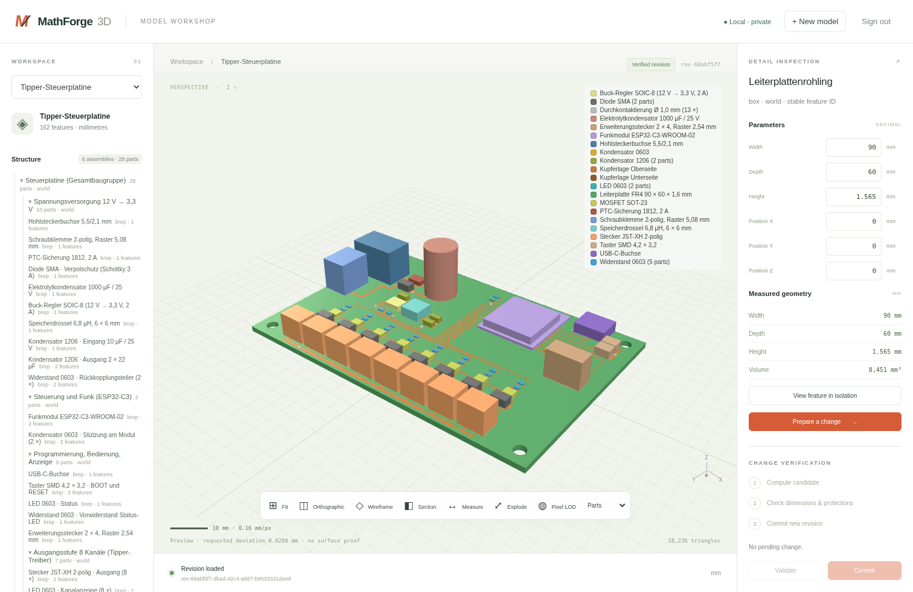
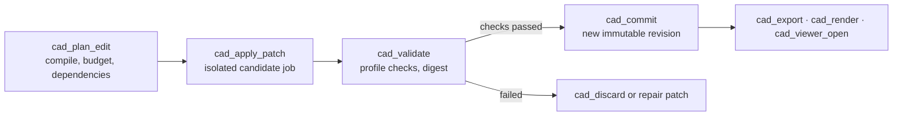
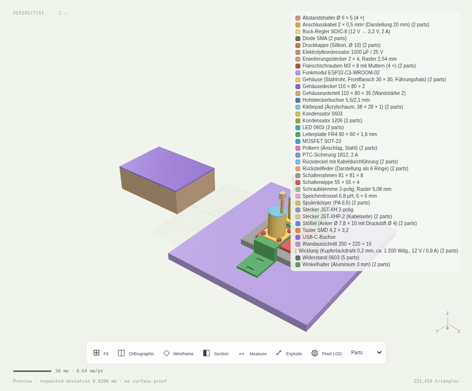

# LLcad

**A mathematics-first CAD server for MCP clients.** Your agent describes parts and assemblies in
plain language; LLcad turns them into versioned parametric constructions on a real
Open CASCADE kernel, checks every change and only then commits it. A browser viewer is
optional and can be opened and closed by the agent itself.



## Why

- **Real geometry, not pictures.** Boxes, cylinders, profiles, extrusions, sweeps, lofts,
  booleans, holes, fillets, threads, patterns, implicit fields, NURBS and measured B-Rep
  facts, all computed by Open CASCADE in a sandboxed worker.
- **Every change is verified.** A change is planned, computed as an isolated candidate,
  validated against a precision profile and committed atomically with a server-generated
  digest. Old revisions never change.
- **Made for agents.** 25 typed tools with strict input and output schemas, semantic feature
  search, face provenance, structure queries and machine-readable errors. No clicking,
  no ID hunting, no free-form payloads.
- **Works with any MCP client.** Local stdio for agents such as OpenCode or Hermes, or a
  shared HTTP endpoint with bearer or OAuth authentication.

## Quick start

```bash
git clone https://github.com/Tends2o/LLcad.git
cd LLcad
npm run setup            # Python venv with Open CASCADE, npm ci, schemas, build
```

Requirements: Linux x86-64, Node 24, Python 3.13, Bubblewrap and `libgl1`; details in
[Getting started](docs/getting-started.md).

Then register the server in your client. The stdio entry point needs no port, token or login:

```json
{
  "mcpServers": {
    "llcad": {
      "command": "/absolute/path/to/LLcad/deployment/start-mcp.sh"
    }
  }
}
```

Ready-made snippets for OpenCode, Hermes, the generic `mcpServers` format and the HTTP mode
are in [Connecting MCP clients](docs/mcp-clients.md). A first prompt:

> Create a 90 × 60 mm circuit board, 1.6 mm thick, with four M3 mounting holes 4 mm from the
> corners. Validate it, commit it and open the viewer.

## How a change flows



The client never sends geometry; it sends typed operations with units. The server compiles
them into a dependency graph, computes only the dirty features in a Bubblewrap sandbox,
measures the result and binds the validation digest to the exact candidate, kernel build and
policy. [Architecture](docs/architecture.md) shows the moving parts.

## The viewer



The viewer is a read-mostly window into the same revisions: structure and feature tree,
parameters, measurements, section plane, wireframe, explosion, part colours with a legend and
pixel-adaptive tessellation. `cad_viewer_open` starts it on demand over stdio (loopback only)
or points at the running HTTP service, hands the browser a single-use login code and can
preselect a model; `cad_viewer_close` stops it again. See [Viewer](docs/viewer.md).

## Tools

| Purpose | Tools |
|---|---|
| Discover and read | `cad_capabilities`, `cad_list_models`, `cad_get_model`, `cad_structure`, `cad_find`, `cad_inspect`, `cad_measure`, `cad_compare` |
| Change | `cad_create_model`, `cad_plan_edit`, `cad_apply_patch`, `cad_solve_constraints`, `cad_validate`, `cad_commit`, `cad_discard`, `cad_revert`, `cad_rebuild` |
| Files and jobs | `cad_import`, `cad_export`, `cad_render`, `cad_job_get`, `cad_job_cancel` |
| Access and viewer | `cad_access`, `cad_viewer_open`, `cad_viewer_close` |

Every tool is described with its contract in [Tools and protocol](docs/api.md). The current
operator list, formats, limits and precision profiles come from `cad_capabilities`.

## Documentation

- [Getting started](docs/getting-started.md): installation, running, data directory, updates.
- [Connecting MCP clients](docs/mcp-clients.md): stdio and HTTP configuration for common clients.
- [Tools and protocol](docs/api.md): the 25 tools, the change workflow, face selection, resources.
- [Viewer](docs/viewer.md): what it shows and how agents open and close it.
- [Architecture](docs/architecture.md): services, storage, sandboxing, atomicity.
- [Operations](docs/operating-runbook.md): deployment, backup, restore, failures, retention.
- [Documentation index](docs/README.md): all guides, including the detailed engineering notes.

## Development

```bash
npm run verify           # type check, tests, native geometry tests, MCP workflow, build, browser
npm run test:geometry    # Python worker tests only
npm run schemas          # regenerate JSON schemas and the operator registry
npm run screenshots -- --shot hero:"My model":page
```

Contributor rules are in [AGENTS.md](AGENTS.md). The project status and the open items
towards a production release are tracked in [implementation status](docs/implementation-status.md).
