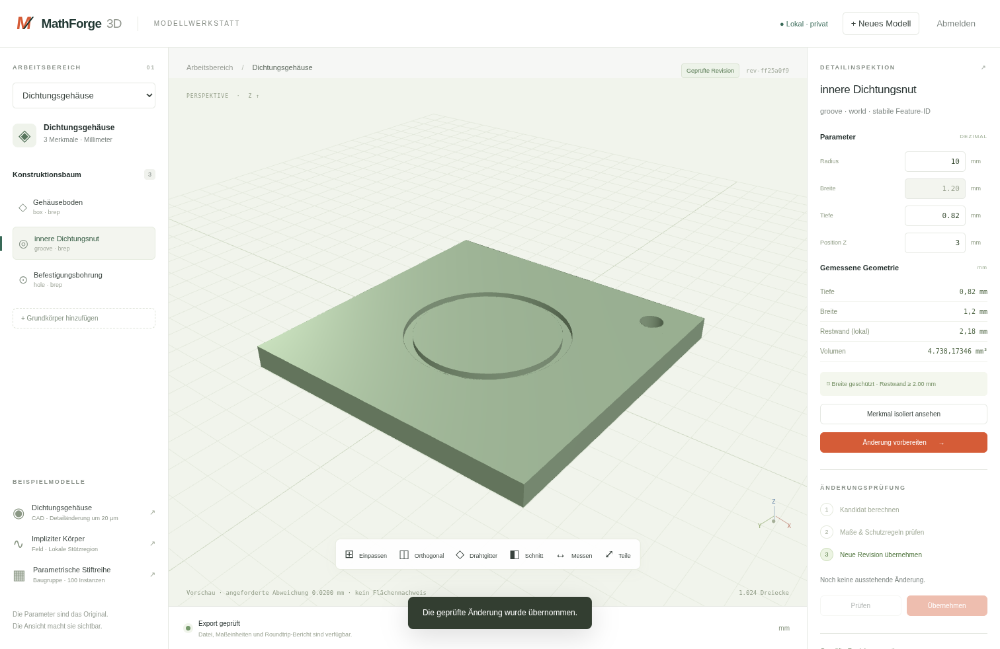

# MathForge 3D

A local, executable implementation of the [mathematics-first blueprint](Mathematik_First_3D_MCP_Bauplan.md): real Open CASCADE geometry, versioned mathematical constructions and 23 MCP tools. **All modelling happens through the LLM.** A browser viewer is optional. Every change passes through **candidate → validation → atomic commit**.

**Status: tested development version 0.1.0.** Full production acceptance of the blueprint is still open. The local Codex transport is installed and verified. Ten real LLM language tasks have passed in the local Codex host; twelve tasks are defined. Still open are the production remote OAuth/HTTPS setup and the items listed in the [implementation status](docs/implementation-status.md). This version reports only capabilities that are actually implemented.



## Operating through the LLM

The LLM discovers models with `cad_list_models`, creates mathematical constructions and locates features with `cad_find` and `cad_inspect`. It plans the change, polls jobs, reads validation proofs, commits valid candidates and exports files. No manual model selection and no clicks in the viewer are required. Genuine ambiguities are resolved through further tool queries or a short question in the conversation.

On this machine `llcad.service` is already running; Codex is connected to the shared local HTTP service and loads its credentials automatically. Two concurrent connections and a complete modelling workflow have been verified. Details are in [local Codex operation](docs/local-codex.md).

Alternatively, a local MCP host can start `deployment/start-mcp.sh`. This entry point uses stdio, opens no network port and needs neither a browser login nor a token. The private operating-system process determines the local identity. The existing exclusive data lock still applies: the HTTP service and the stdio service must not open the same data directory at the same time.

```bash
npm run test:mcp
```

The integration test drives construction, semantic search, face selection, a 20 µm groove change, validation, commit, rebinding and STEP export through the official MCP SDK. `reports/mcp-workflow.json` documents the tool calls and **zero browser interactions**. This is an SDK/controller test. In addition, `npm run test:host` checks the actually installed Codex app server; `reports/codex-host.json` holds that host transport proof. `npm run test:llm` runs the language tasks that the model itself has to solve: groove correction with STEP export, diameter correction, ambiguous selection, a single instance, an existing local field correction, a pocket in a rotated part, circular-pattern occurrences, same-named housings in an assembly structure, a scoped shared project, a mesh round trip, a hidden inner groove under a flange and refinding the same groove after a topology change. The report `reports/llm-eval.json` contains the actual CAD calls, numerical checks, host/model version, latency and token usage. Remote OAuth acceptance and a broad general LLM evaluation remain open.

## Starting the optional viewer

Here the optional viewer is already served by the running service. On a separate installation without a running service:

```bash
npm start
```

Open **http://127.0.0.1:4310**. On first start the server generates a private local key. To show it in your terminal:

```bash
cat data/local-token
```

Enter the key in the login dialog for the optional manual view. Local mode binds to loopback only. Operating through the LLM does not need this dialog.

## Installing on a new machine

Tested with Linux x86-64, Node **24.19.0**, Python **3.13.5**, Bubblewrap and the exactly locked dependencies. Required system packages: `python3-venv`, `bubblewrap`, `libgl1`, `python3-openvdb=10.0.1-2.3+b1` (Debian 13, matching Python 3.13), `util-linux` (for `/usr/bin/flock`); the matching Python and Node versions must be installed. User namespaces must be available for the worker.

```bash
npm run setup
npx playwright install --with-deps chromium
npm run verify
npm start
```

`deployment/setup.sh` uses `requirements.lock` and `npm ci`. No shell, Python or JavaScript code from model data is ever executed. The Python adapter calls the native OCCT bindings; every computation runs in a separate Bubblewrap namespace without network access.

## What works

- Typed decimal parameters with units, stored mathematical expressions, a DAG compiler, protected parameters and bounded resources.
- Box, sphere, cylinder, cone, torus; profiles, Bézier/B-spline curves, rational surfaces; extrusion, revolution, loft, sweep; CSG; holes, pockets, grooves, fillets, chamfers and shells within their operator contracts.
- Points, lines, arcs, finite planes, UV trimming, caps, sewing, regularisation and custom helical threads.
- Transformations, mirroring, instances and linear and circular patterns with targeted single-occurrence variants; analytic inverse volume construction and a coupled, bounded SLSQP dimension solver; real B-Rep measurements and distance jobs.
- Implicit field graphs, compact local edits, invertible local deformation, conservative Lipschitz bounds and sparse octree surface extraction.
- Local control-point edits with exact rational C0/C1/C2 bounds and regularity checks for registered patch joins; broken joins block the commit.
- Explicit recomputation after a build change with `cad_rebuild`, full validation and unchanged old revisions.
- Durable SQLite revisions, isolated candidates, content cache, jobs with fencing, idempotency, mandatory checks, compare-and-swap and audit/outbox processing.
- Authentication and object-level ownership checks for models, jobs, selections, resources and files.
- Versioned projects, assemblies and parts, separate geometric authorities and hierarchical local frames; LLM queries through `cad_structure`.
- Native face provenance for registered primitives, boolean operations, groove/hole/pocket, transformations and instances; stored face handles and explicit unambiguous rebinding. Splits, merges and unknown provenance are safely rejected.
- Durable fair job scheduling between users, offline maintenance lock, verified backup/restore path and tenant-scoped erasure of the active data store.
- IR/STEP/STL/OpenVDB import (STEP optionally with its product structure as frames, assemblies and parts) and IR, STEP, B-Rep, STL, GLB and OpenVDB export with re-verification. Mesh and field previews keep their explicitly limited proof status.
- Rigorous interval arithmetic with gradient-flow certificates for field changes, blend-free mating regions, dual contouring, implicit curvature, ISO basic thread profiles, offsets, sweeps with rotation-minimising frames, mesh repair, local remeshing and ARAP deformation of authoritative meshes.
- Measurements with declared proof strength: Chamfer/Hausdorff samples, exact minimum distance and IoU, sampled wall thickness, clearance along a motion; the `manufacturing_candidate` profile with sampled process rules and no certification.
- Adaptive per-face tessellation with a resolution report, spatial excerpts, SVG section and projection views, error budget, repair chains, internal publication with short-lived signed links, retention policy, metrics and a small pool of pre-warmed isolated workers.
- Viewer with structure and feature tree, parameters, measurements, revisions, section, wireframe, zoom, orthographic view, point measurement with markers, before/after overlay, protected/change regions, scale bar, diagnostic display channels and pixel LOD.

The current list comes from `cad_capabilities`. Manufacturing certification, GPU evaluation and general OCAF face re-resolution are not reported as available.

## Verifiable example workflow

```bash
npm run demo
```

Stop the server first: a data directory has exactly one active service or maintenance process. The command builds the housing, validates and commits the base, changes the groove from **0.80 to 0.82 mm**, validates again and writes the STEP round trip to `reports/demo/`. Each run creates its own model.

Among the measured values are **1.20 mm groove width** and **2.18 mm remaining wall in the declared planar box zone**. The original revision is preserved. The report states the actual coverage; the local remaining-wall check is not a global wall-thickness certification.

## MCP connection

Endpoint: `POST /mcp`. The local development key is sent as `Authorization: Bearer …`. OAuth mode is intended for remote use. Tool arguments never carry a freely chosen user or tenant identity.

Implemented separately and tested locally:

| Protocol | Adapter |
|---|---|
| `2025-03-26`, `2025-06-18`, `2025-11-25` | Official TypeScript SDK 1.30.0 with `initialize`, version negotiation and Streamable HTTP |
| `2026-07-28` | Separate adapter with `server/discover`, required request metadata, header matching and `resultType` |

All 23 tools are described in [Interfaces](docs/api.md). Besides the HTTP endpoint, the local stdio transport is implemented and tested with reconnection. The [compatibility matrix](docs/compatibility-matrix.md) separates protocol tests from host tests that have not been run yet.

## Development and operation

```bash
npm run verify          # TypeScript, integration, native geometry, MCP workflow, build, Chromium
npm run test:llm        # Twelve real language tasks in the installed Codex host; consumes model usage
npm run benchmark       # Measured local latencies and resources
npm run schemas         # JSON schemas and operator registry generated from the source
npm run format:check
npm run release:check   # Exit 2 while production proofs are missing
```

Results are written to `reports/`, in particular `verification.json`, `benchmark.json`, `release-manifest.json` and `demo/report.json`. [Architecture](docs/architecture.md), [mathematical contracts](docs/mathematical-contracts.md), [interval certificates](docs/intervals-and-certificates.md), [measurements](docs/measures.md), [imports](docs/imports.md), [viewer](docs/viewer.md), [threat model](docs/threat-model.md) and [operating runbook](docs/operating-runbook.md) describe limits and recovery. `tsx scripts/minimize-fixture.ts <fixture.json> --expect <CODE>` shrinks a failing IR to a minimal reproduction; `tests/regression/corpus.ts` keeps the geometric boundary classes with declared expectations. The remaining documentation under `docs/` is written in German.

The local systemd installation is active. Further systemd and HTTPS proxy templates are under `deployment/`. No public service has been published.
