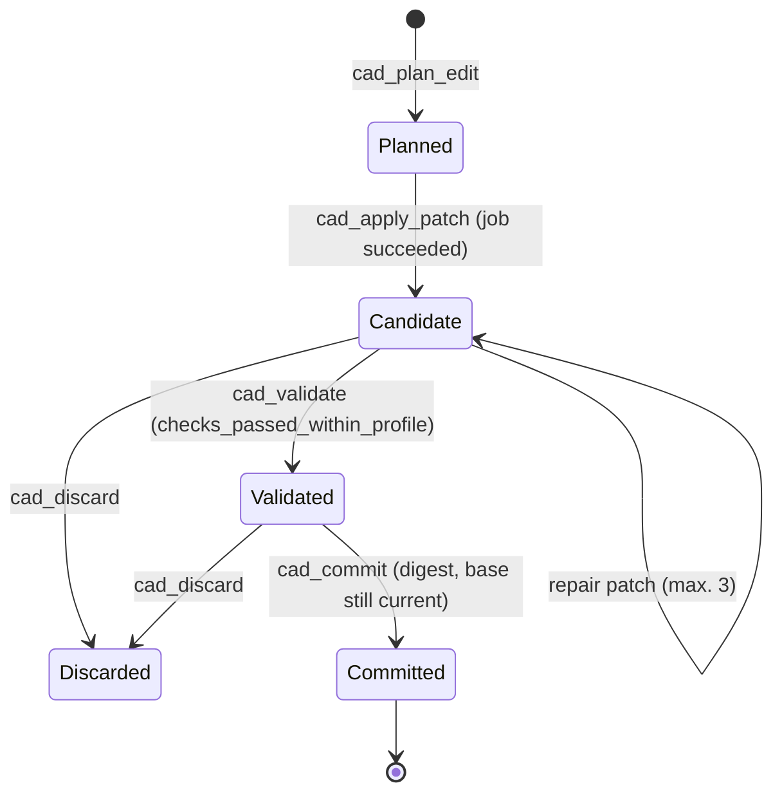

# Tools and protocol

Input schemas under `schemas/cad_*.schema.json` and tool-specific result schemas under
`schemas/cad_*.result.schema.json` are generated from the same strict Zod contracts that
validate every call at run time. Results carry `result_schema_version: "1"`; unused bindings
are explicitly `null`; unknown fields are rejected. Status and errors stay machine-readable;
internal paths, tokens and stack traces never appear in tool errors.
[Result contracts](result-contracts.md) describe the metadata fields, resource budgets and
the unchanged readability of older records.

## Tools

| Tool | Result and effect |
|---|---|
| `cad_capabilities` | Implemented operators, formats, precision profiles, limits |
| `cad_list_models` | Own and explicitly shared models by name or purpose, paged; no known IDs or viewer interaction needed |
| `cad_access` | Current role, feature scope and budget; owners create bound grant, revocation and internal publication requests and read publications with short-lived signed links; a separate trusted confirmation is required ([publication-and-retention.md](publication-and-retention.md)) |
| `cad_create_model` | Private empty model; own idempotency key |
| `cad_get_model` | Revision summary with build compatibility and pages of up to 64 features, each with operator, dependencies, part, frame and declared parameters (bulk read instead of one `cad_inspect` per feature) |
| `cad_structure` | Versioned project, assembly, part and frame packages with search, paging, definitions, extents and the structure hash |
| `cad_find` | Semantic and spatial candidates and short-lived selection handles |
| `cad_inspect` | Feature, construction, measured dimensions, protections, paged native faces, selection handle and explicit rebinding |
| `cad_measure` | Registered measurements; jobs for distance, angle, curvature (native and implicit), static and moving clearance, surface distance (Chamfer/Hausdorff samples, exact minimum, IoU), wall thickness, thread fit, primitive hypotheses, blend activity and certified surface deviation; every number with its proof strength ([measures.md](measures.md)) |
| `cad_plan_edit` | Compiled edit, solved parameters, dependencies, sensitivities and budget |
| `cad_solve_constraints` | Bounded coupled dimension solving; the job returns patch proposals and stored equation constraints, then validate and commit as usual |
| `cad_apply_patch` | Transaction and isolated computation job; no commit |
| `cad_validate` | Full mandatory profile job for one candidate; the job result carries `status`, `check_count`, failed `checks` and the `digest` |
| `cad_compare` | Changed features and declared measurement differences between two revisions |
| `cad_commit` | Compare-and-swap with the bound validation digest; answers `status: committed` |
| `cad_discard` | Drop an uncommitted candidate |
| `cad_revert` | Propose an earlier construction as a new candidate |
| `cad_rebuild` | Plan and compute the unchanged construction for the current build as a new candidate |
| `cad_render` | Derived preview artifact: adaptive per-face tessellation with a resolution report, spatial excerpt (`region`) and SVG section or projection views (`view`, [diagnostic-views.md](diagnostic-views.md)) |
| `cad_import` | Read an uploaded artifact into a candidate: IR, STEP (flat or with its product structure through a probe job), STL, OpenVDB ([imports.md](imports.md)) |
| `cad_export` | Export a committed revision with a format and round-trip report; `ir` answers synchronously, geometry formats return a job |
| `cad_job_get` | Durable job status and result |
| `cad_job_cancel` | Cancel a job with fencing |
| `cad_viewer_open` | Start (stdio) or address (HTTP) the browser viewer, mint a single-use login code, optionally preselect a model and launch the browser |
| `cad_viewer_close` | Stop the on-demand viewer (stdio) or report that the shared service keeps serving it (HTTP) |

All mutating model operations require the exact base revision and an idempotency key of 16
to 128 characters. A key may be reused per owner only for the same normalised operation; use
different keys for plan, apply, validate and commit.

Project roles, budget reservations, expiry, revocation and the separate policy path are
described in [project access](project-access.md). The feature scope restricts changes; read
rights cover the whole model including its history.

## Workflow

The primary interface is the agent over MCP; the viewer is optional. Identities and rights
come from the transport, never from tool arguments. The stdio entry point needs no
interactive login.



1. `cad_create_model`, then add features with `cad_apply_patch` or read an uploaded file with
   `cad_import`.
2. Poll `cad_job_get` until `succeeded`, `failed` or `cancelled`. A successful computation
   returns `candidate_revision` and `transaction_id`.
3. `cad_validate` with model, base revision and transaction ID; poll the job again. Its
   result reports `status`, `check_count`, only the failed `checks` and the `digest`.
4. Only on `checks_passed_within_profile`: `cad_commit` with exactly that digest as
   `validation_digest`. The answer is `status: committed` with the new revision.
5. Use the new revision for later edits, measurements or exports.

Patch operations: `add_feature`, `set_outputs`, `add_constraint`, `set_parameter`,
`set_expression`, `solve_volume`, `set_surface_poles`, `insert_surface_knots`, `set_field`,
`set_construction`, `set_pattern_occurrence`, `set_structure`, `set_feature_context`. A patch
can be bound to a failed candidate of the same base with `repair`; at most three repair
attempts with cause, cost and intent comparison are allowed. There are no free payloads and no
executable programs. A patch holds at most 64 operations; a model at most 512 features.
`cad_plan_edit` also reports sensitivities of changed parameters and a conditioning check of
the world coordinates; `cad_inspect` optionally returns sections (`sections`), neighbouring
faces, the separate quality status per entity and a semantic selection anchor (`anchor`).

Project, assembly and part names are resolved with `cad_structure`: `kind` selects the level,
`query` the semantic search words, `entity_id` optionally narrows to one known element.
Features inside a found part are located with `cad_find.owner_part`. `set_structure` binds to
the returned `structure_hash`; `set_feature_context` binds to `cad_inspect.context_hash`.
Structure and context changes may share one candidate patch. Declared part outputs and model
outputs must agree. Coordinates and cache limits are described in
[structure-and-frames.md](structure-and-frames.md).

## Moving to a new build

`cad_get_model.build_compatibility` reports `current`, `rebuild_required` or
`unsupported_construction`. On `rebuild_required` read the current `registry_hash` from
`cad_capabilities`. `cad_rebuild` expects the model, the exact base revision, an idempotency
key and `target_registry_hash`. The default `plan` mode reports effort, IR hashes and
protections without a candidate; `mode: "candidate"` with its own key then computes the
unchanged construction. Old revisions are kept and all protections still apply; candidates
must be validated and committed normally. A stale target hash is rejected.
`unsupported_construction` needs a separate migration of the construction that no longer
compiles.

## Native faces and agent selection

`cad_inspect` returns `face_page` with `geometry_feature_id`, measured face data, `origins`,
`face_id` and `next_offset`; `face_offset` and `face_limit` (at most 16) bound the answer.
Faces can be queried completely through this data; a viewer click is never a prerequisite.

To bind a face, pass `model_id`, an **explicit** `revision`, the ID of the displayed geometry
feature and `face_id`. `selected_entities` names the unambiguous generating feature;
`selected_face.geometry_feature_id` names its resulting geometry. The returned
`selection_handle` can restrict a patch to that feature alone; global `set_outputs` or add
operations are not allowed with such a handle.

To continue after a change, send `selection_handle`, the explicit new `revision` and
`rebind: true` to `cad_inspect`. Only a unique successor in **every** intermediate revision
yields a new handle. A split, merged, removed, foreign or expired target is never replaced
silently. New face IDs are revision-bound addresses, not names that are stable across
revisions. Unknown provenance answers `AMBIGUOUS_SELECTION`; the agent then determines the
intended feature with `cad_find` or asks one short question.

## HTTP example for 2026-07-28

```http
POST /mcp
Authorization: Bearer <access token>
Content-Type: application/json
Accept: application/json, text/event-stream
Mcp-Protocol-Version: 2026-07-28
Mcp-Method: tools/call
Mcp-Name: cad_capabilities

{
  "jsonrpc":"2.0",
  "id":1,
  "method":"tools/call",
  "params":{
    "name":"cad_capabilities",
    "arguments":{},
    "_meta":{
      "io.modelcontextprotocol/protocolVersion":"2026-07-28",
      "io.modelcontextprotocol/clientCapabilities":{},
      "io.modelcontextprotocol/clientInfo":{"name":"my-client","version":"1"}
    }
  }
}
```

This adapter does not require the older initialisation. The SDK adapter supports
`2025-03-26`, `2025-06-18` and `2025-11-25` through `initialize` and offers the tested
`2025-11-25` to clients that request another version. That is version negotiation inside the
older initialisation flow; the `2026-07-28` adapter stays separate.

## Resources and files

Logical resources are `cad://models/{model_id}/revisions/{revision}/summary`,
`…/features/{feature_id}`, `cad://transactions/{transaction_id}/validation` and
`cad://artifacts/{artifact_id}/manifest`. Every access requires authentication and object
permission.

The viewer uploads files through `POST /api/uploads` with `application/octet-stream`; the
answer contains the server-generated artifact ID. `GET /api/artifacts/{artifact_id}` serves
only authorised content. There is no freely resolvable hash address and no automatic external
publication. `POST /api/tools/{name}` calls a tool without MCP framing, using the same bearer
key.

Tool results are limited to 32 KiB. Complete validation reports are read through their
resource URI; geometry stays in the artifact store. A transport abort does not revoke an
accepted durable job; `cad_job_cancel` does.

Response shape, finite numbers, target binding and budget are checked before any writing
result is stored. An `OUTPUT_CONTRACT_VIOLATION` or an exceeded response budget rolls back the
SQL transaction including the new idempotency record; the request can be repeated with the
same key once the cause is fixed. New validation evidence uses version 2 with candidate,
engine and geometry binding per check. The digest returned by `cad_job_get` belongs to the
complete resource report even when only the first failed checks are displayed.
