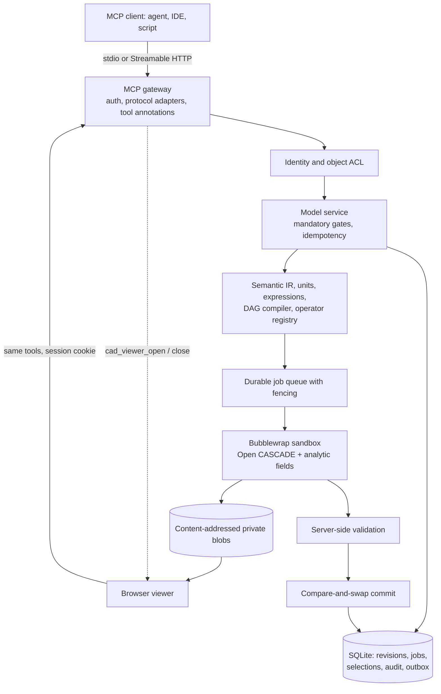

# Architecture

The original blueprint (`Mathematik_First_3D_MCP_Bauplan.md`) stays unchanged in the
repository; this page describes what is actually built.

## States and atomicity

A new model holds an empty draft revision. `cad_apply_patch` compiles a bounded change graph
and writes transaction, job, idempotency record and dispatch outbox in one SQLite
transaction. A worker produces an immutable candidate revision. It is readable but does not
become the model head.

`cad_validate` produces a server-side report. Its digest binds IR, geometry facts, candidate
revision, operator registry, native sources and policy. `cad_commit` re-checks permissions and
requires the base revision to be current. New revision, model head, audit and commit outbox
are written together. A repeated identical request returns the stored effect.

A lost worker lease may be executed again after it expires. Results are accepted only while
job state and fencing token still match. Cancel and discard set the state before a late
worker answer can arrive. `after_commit` runs through the outbox; its failure never undoes an
existing commit.

## Transports and the viewer

| Entry point | Process model | Viewer |
|---|---|---|
| `packages/mcp-gateway/stdio.ts` | one process per client, identity = OS user, no listener | `EmbeddedViewer` starts a loopback HTTP viewer on `cad_viewer_open` and stops it on `cad_viewer_close` |
| `packages/mcp-gateway/main.ts` | shared HTTP server, bearer key on loopback or OAuth | served on the same origin; `cad_viewer_open` mints a single-use login code |

Both transports use the same `ModelService`, the same tool definitions and the same result
contracts. Viewer tools are the only asynchronous tools; every other tool answers
synchronously inside one SQL transaction.

## Module boundaries

| Path | Responsibility |
|---|---|
| `packages/semantic-ir` | Strict schemas, decimal quantities, safe errors, canonical hashes, result contracts |
| `packages/compiler` | Operator contracts, AST limits, expressions, dependencies, dirty graph, mathematics |
| `packages/policy` | Scopes, ownership binding, approvals, download tokens |
| `packages/model-service` | Revisions, selections, import and export, blobs, backup and restore |
| `packages/job-service` | Durable queue, fencing, restart, native process boundary |
| `packages/validation` | Executed geometry and parameter checks and protections |
| `packages/mcp-gateway` | Authentication, protocol adapters, HTTP app, viewer host |
| `workers/cad-occt` | Open CASCADE bindings and the analytic field kernel in the isolated process |
| `packages/viewer` | Derived Three.js view; all edits go through the same tools |

## Deliberate technical choices

Open CASCADE is called through its Python bindings instead of a custom C++ RPC wrapper; the
geometry kernel itself is native. SQLite in WAL mode and a local object store replace a
distributed database and queue, which keeps the commit atomic without extra services.

Organic previews use a sparse octree with Lipschitz or interval pruning and marching
tetrahedra or dual contouring. The OpenVDB export adapter re-reads every stored Float32 field
sample; the import adapter reads axis-aligned grids as interpolating spline fields with a
measured Lipschitz bound. STEP assemblies can be imported with their product structure as
frames, assemblies and parts through a probe job with server-side continuation. Private
samples are reused across resolutions and compact local edits. CGAL EPECK predicates check
authoritative meshes in the `watertight_solid` profile; `manufacturing_candidate` samples
explicit process rules without certifying them.

One worker handles one job in a disposable sandbox process; up to four jobs run in parallel
(`MATHFORGE_WORKERS`) and a small pool of pre-warmed processes (`MATHFORGE_WARM_WORKERS`) has
the native libraries imported before any job data arrives. Inputs and results are bounded,
sources are bound immutably and cache entries are tenant-scoped. Jobs carry phase, heartbeat
and an approved time budget; `on_failure` and `on_cancel` are registry events with typed
contexts. Durable metrics (`/api/metrics`) and the retention policy are described in
[publication-and-retention.md](publication-and-retention.md).
