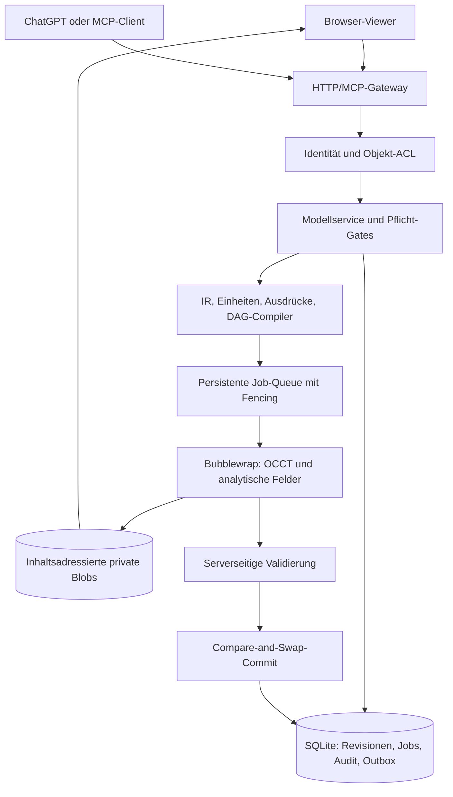

# Architektur

Der ursprüngliche Bauplan bleibt unverändert im Repository. Diese Datei beschreibt den tatsächlich gebauten Stand.

## Zustände und Atomarität

Ein neues Modell enthält eine leere Entwurfsrevision. `cad_apply_patch` kompiliert einen begrenzten Änderungsgraphen und schreibt Transaktion, Job, Idempotenzresultat und Dispatch-Outbox in derselben SQLite-Transaktion. Ein Worker erzeugt eine unveränderliche Kandidatenrevision. Sie ist lesbar, wird aber nicht zum aktuellen Modellzeiger.

`cad_validate` erzeugt einen serverseitigen Bericht. Der Digest bindet IR, Geometriefakten, Kandidatenrevision, Operatorregister, native Quellen und Policy. `cad_commit` prüft Rechte erneut und verlangt die noch aktuelle Basisrevision. Neue Revision, Modellzeiger, Audit und Commit-Outbox werden gemeinsam übernommen. Ein erneuter identischer Request liefert die bereits gespeicherte Wirkung.

Ein verlorener Worker-Lease darf nach Ablauf erneut ausgeführt werden. Ergebnisse werden nur angenommen, wenn Jobzustand und Fencing-Token weiterhin passen. Abbruch und Verwerfen setzen den Zustand vor einer möglichen späten Worker-Antwort. `after_commit` läuft über die Outbox; sein Ausfall macht einen vorhandenen Commit nicht rückgängig.

## Modulgrenzen

| Pfad | Verantwortung |
|---|---|
| `packages/semantic-ir` | Strikte Schemas, Dezimalgrößen, sichere Fehler, kanonische Hashes |
| `packages/compiler` | Operatorverträge, AST-Grenzen, Formeln, Abhängigkeiten, Dirty-Graph, Mathematik |
| `packages/policy` | Scopes und Eigentümerbindung |
| `packages/model-service` | Revisionen, Auswahl, Import/Export, Blobs, Backup/Restore |
| `packages/job-service` | Dauerhafte Queue, Fencing, Wiederanlauf und native Prozessgrenze |
| `packages/validation` | Ausgeführte Geometrie-/Parameterprüfungen und Schutzbedingungen |
| `packages/mcp-gateway` | Authentifizierung, Versionsadapter, HTTP und Tool-Annotationen |
| `workers/cad-occt` | OCCT-Bindings und analytischer Feldkern im isolierten Prozess |
| `packages/viewer` | Abgeleitete Three.js-Ansicht; sämtliche Änderungen über dieselben Tools |

## Bewusste technische Abweichungen

OCCT wird über die passenden Python-Bindings statt eines eigenen C++-RPC-Wrappers angesprochen. Der Geometriekern selbst ist nativ. SQLite/WAL und ein lokaler Objektspeicher ersetzen einen verteilten Datenbank-/Queue-Aufbau. Das ermöglicht die atomare Übernahme ohne zusätzliche Dienste.

Für organische Vorschauen wird ein eigener sparsamer Octree mit Lipschitz- oder Intervallausschluss und Marching Tetrahedra beziehungsweise Dual Contouring verwendet. Der OpenVDB-Exportadapter prüft alle gespeicherten Float32-Feldsamples nach dem Zurücklesen; der Importadapter liest achsparallele Grids als interpolierende Spline-Felder mit gemessener Lipschitz-Schranke. STEP-Baugruppen können mit ihrer Produktstruktur als Rahmen, Baugruppen und Teile eingelesen werden; dafür läuft ein Probe-Job mit serverseitiger Fortsetzung. Private Samples werden über Auflösungen und kompakte lokale Änderungen wiederverwendet. CGAL-EPECK-Prädikate prüfen maßgebliche Netze im Profil `watertight_solid`; `manufacturing_candidate` tastet ausdrückliche Prozessregeln ab, ohne zu zertifizieren.

Ein Worker verarbeitet jeweils einen Job in einem Einweg-Sandbox-Prozess; bis zu vier Jobs laufen parallel (`MATHFORGE_WORKERS`), und ein kleiner Pool vorgewärmter Prozesse (`MATHFORGE_WARM_WORKERS`) hat die nativen Bibliotheken bereits importiert und wartet ohne Auftragsdaten. Die Eingangs- und Ergebnisdaten sind begrenzt, die Quellen unveränderlich eingebunden und Cacheeinträge mandantenbezogen. Jobs tragen Phase, Heartbeat und genehmigtes Zeitbudget; `on_failure` und `on_cancel` sind Registerereignisse mit typisierten Kontexten. Dauerhafte Kennzahlen (`/api/metrics`) und die Aufbewahrungspolitik stehen in [publication-and-retention.md](publication-and-retention.md).
