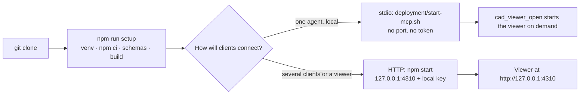

# Getting started

LLcad runs as one Node process that owns a SQLite data directory and starts sandboxed Python
workers for the Open CASCADE geometry kernel. It speaks MCP over stdio (one process per client)
or over HTTP (one shared server with a browser viewer).

## Requirements

| Component | Tested with |
|---|---|
| Operating system | Linux x86-64 (Debian 13); the worker sandbox uses Bubblewrap and user namespaces |
| Node.js | 24.19 |
| Python | 3.13 with `python3-venv` |
| System packages | `bubblewrap`, `libgl1`, `util-linux` (`/usr/bin/flock`), `python3-openvdb` 10.0.1 (Debian package, matching Python 3.13) |
| Optional | Chromium via Playwright for the browser tests and screenshots |

`deployment/setup.sh` checks these versions before it installs anything. The exact native
package versions are listed in `deployment/native-packages.json`.

## Install

```bash
git clone https://github.com/Tends2o/LLcad.git
cd LLcad
npm run setup
```

The setup creates `.venv` from `requirements.lock`, runs `npm ci`, generates the JSON schemas
and builds `dist/` and the viewer bundle. Nothing is downloaded at run time and no code from
model data is ever executed.



## Run

### Over stdio (recommended for a single agent)

Point your MCP client at `deployment/start-mcp.sh`. The script changes into the checkout and
starts `dist/packages/mcp-gateway/stdio.js`. The client owns the process; there is no network
listener, no token and no login. Identity is the operating-system user. When the agent calls
`cad_viewer_open`, the process starts a loopback-only HTTP viewer on `MATHFORGE_VIEWER_PORT`
(default 4310, or a free port) and stops it again on `cad_viewer_close`.

After `npm link` the same entry point is available anywhere as `llcad-mcp`.

### Over HTTP (shared server)

```bash
npm start                # http://127.0.0.1:4310
cat data/local-token     # bearer key for clients and the viewer login
```

The MCP endpoint is `POST /mcp`; clients send `Authorization: Bearer <local-token>`. The
viewer is served from the same origin. Local mode binds to loopback only; remote access needs
`MATHFORGE_AUTH=oauth` and an identity provider (see [Operations](operating-runbook.md)).

## Data directory

All revisions, jobs, blobs, selections and audit events live in one directory (`data/` by
default, `MATHFORGE_DATA` overrides it). Exactly one process may open it; a second server,
the demo or a maintenance command receives `STORE_BUSY`. Keep the stdio and HTTP entry points
on different directories if you run both.

| Variable | Meaning | Default |
|---|---|---|
| `MATHFORGE_DATA` | Data directory | `data` |
| `HOST`, `PORT` | HTTP listener | `127.0.0.1`, `4310` |
| `MATHFORGE_PUBLIC_URL` | Origin the HTTP server answers for | `http://127.0.0.1:4310` |
| `MATHFORGE_AUTH` | `local` (bearer key on loopback) or `oauth` | `local` |
| `MATHFORGE_VIEWER_PORT` | Port of the on-demand viewer over stdio; `0` picks a free port | `4310` |
| `MATHFORGE_WORKERS`, `MATHFORGE_WARM_WORKERS` | Parallel sandboxes (1–4) and pre-warmed pool (0–2) | `1`, `1` |
| `MATHFORGE_DEBUG_ERRORS` | Print worker diagnostics to stderr (never to clients) | unset |

## Try it without a client

```bash
npm run demo             # builds a housing, changes a groove by 20 µm, validates, commits, exports STEP
npm run test:mcp         # drives the whole workflow through the official MCP SDK
```

Stop a running server first; both commands open their own data directory.

## Updating

```bash
git pull
npm run setup
npm run verify
```

A new build may change the operator registry hash. Models then report
`build_compatibility.status = rebuild_required` in `cad_get_model`; the agent rebuilds them
explicitly with `cad_rebuild` (plan, candidate, validate, commit) and all old revisions stay
readable. Details in [Tools and protocol](api.md).
