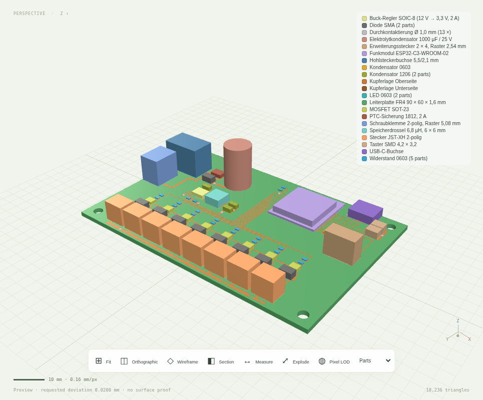
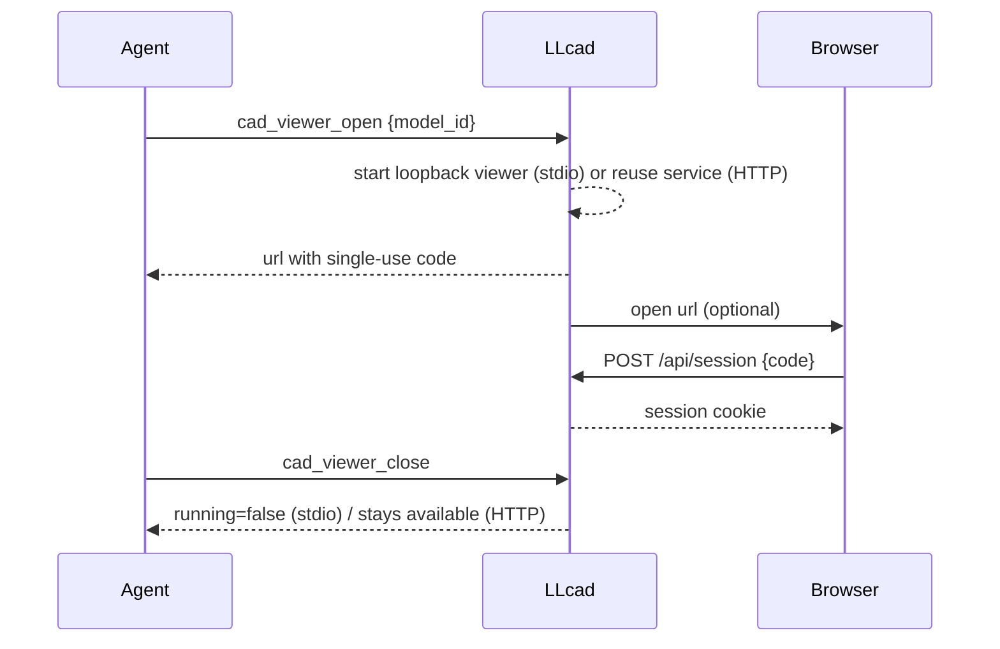
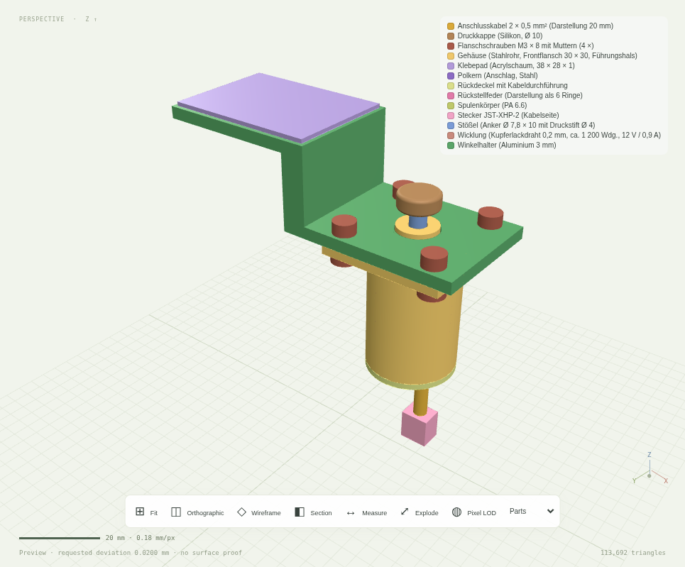

# Viewer

The viewer shows derived meshes of committed revisions and candidates; the geometry service
decides. Every edit started in the viewer runs through the same tools, permissions, candidate
and commit gates as an agent's edit. Meshes are uploaded to the GPU with local origins so that
details survive large world coordinates in Float32 (`preview-coordinates.md`).

## Opening and closing it from an agent

| Tool | Over stdio | Over HTTP |
|---|---|---|
| `cad_viewer_open` | starts a loopback-only HTTP viewer on demand (`MATHFORGE_VIEWER_PORT`, default 4310, `0` = free port) | points at the running service |
| `cad_viewer_close` | stops that listener and its browser sessions | reports that the viewer stays available with the service |

`cad_viewer_open` returns `url`, `running`, `transport`, `browser_launched` and a message. The
URL carries a **single-use login code** in the fragment (`#code=…`, valid five minutes) so the
browser needs no token entry; the fragment never reaches a server log and is removed as soon
as the page has used it. `model_id` preselects a model, `launch_browser` (default `true`)
starts the platform browser when a graphical session exists. Modelling never depends on the
viewer being open.

## What it shows

- Revision, quality status, construction tree and structure: `cad_structure` supplies
  assemblies with `parent_assembly` and parts with representation and feature count; a part
  filters the feature tree and selects its first output feature.
- Safe selection: a click on a native face sends a semantic anchor (`point`, `normal`,
  barycentric coordinates, triangle index, camera direction) to `cad_inspect`; the service
  resolves the generating feature through stored face provenance and answers with a
  `selection_anchor` in the local frame. The triangle index alone is never the selection.
- Typed parameters, measured geometry, protections, point-to-point measurement with markers,
  section plane, wireframe, isolation, explosion and before/after overlay.
- Protected and change regions of the selected feature drawn in world space.
- Scale bar with a round length and the current resolution in mm/px.
- Display channels: parts (default), lit, unlit, normals and native per-face curvature from
  the adaptive preview. Textures or normal maps are never treated as geometry.
- Part colours: the parts channel colours each output part by its part name from
  `cad_structure`; equal names share a colour, a suffix after " · " (a role such as
  "Resistor 0603 · gate") is ignored for grouping. Copper layers and plated vias of a circuit
  board get fixed metal colours. A legend lists groups and part counts. Colours are display
  only, not material data.
- Pixel LOD: derives the target deviation from the pixel size, uses adaptive per-face
  tessellation and limits large models to a region around the view centre. The footer shows
  the absolute resolution and the smallest resolved feature; it is not a geometric proof.

## Limits

Previews stay `preview_only` without a surface proof. A pixel-LOD excerpt invalidates face
regions; face selection then falls back to the feature. `scripts/browser-test.ts` drives
login, structure, channels, LOD, anchors, measurement markers, section, editing and commit in
Chromium (`reports/browser.json`); `npm run screenshots` captures documentation images from a
running server.
